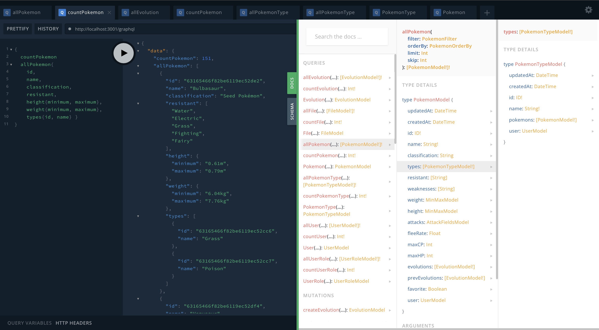
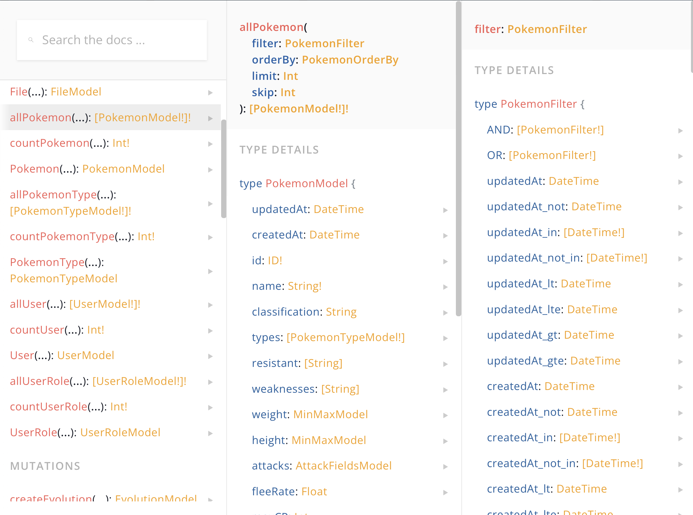
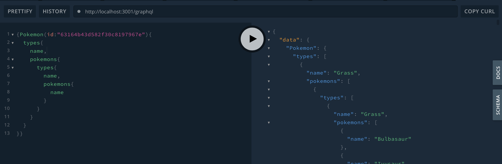
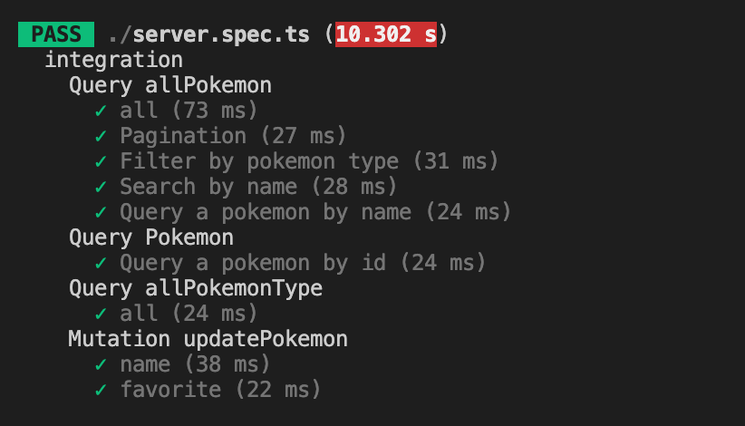
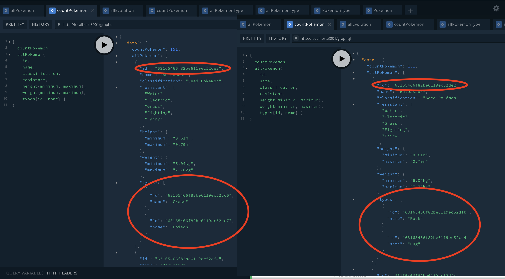

# Solution

## Overview



The project is actualy generated by [GraphQL Monster Builder](https://github.com/miuan/graphql-monster-builder) this is my personal public project. As a source is `brainsoft.schema` [schema file](https://github.com/miuan/graphql-monster-builder/blob/master/Schema.md) located in root of project

```
type MinMax @entity {
    minimum: String!
    maximum: String!
}

type Attack @entity {
    name: String!
    type: String!
    damage: Int!
}

type AttackFields @entity {
   fast: [Attack]
   special: [Attack]
}

@all("public")
@create("public") @one("public") @update("public") @remove("public")
type Pokemon @model {
  name: String! @unique
  classification: String
  types:  [@relation(name: "TypeOnPokemon")]
  resistant: [String]
  weaknesses: [String]
  weight: MinMax
  height: MinMax
  attacks: AttackFields
  fleeRate: Float
  maxCP: Int
  maxHP: Int
  evolutions: [@relation(name: "EvolutionOnPokemon")]
  prevEvolutions: [@relation(name: "prevEvolutionOnPokemon")]
  favorite: Boolean @default(false)
  _evo: @relation(name: "EvoOnPokemon")
}

@all("public")
@create("public") @one("public") @update("public") @remove("public")
type Evolution @model {
   name:  String! @unique
   pokemon: @relation(name: "EvoOnPokemon")
   _pokemonEvo: [@relation(name: "EvolutionOnPokemon")]
   _prevPokemonEvo: [@relation(name: "prevEvolutionOnPokemon")]
}

@all("public")
@create("public") @one("public") @update("public") @remove("public")
type PokemonType @model {
   name:  String! @unique
   pokemons: [@relation(name: "TypeOnPokemon")]
}
```

Generation is by simple command

```
$ npx graphql-monster-builder brainsoft.schema server
```

Result is a GraphQL server located in /server directory
with GRUD for

- Pokemon
- PokemonType
- Evolution

The Query have quite robust filter what you can combining with AND OR and create unique results 

Pokemnon type is connected with `Dataloaders` so is posible endless recursion of pulling data


## Test

You can see more test in graphql-monster-project here is covered just the main functionality


## Pros (of this solution)

- server can be regenerate when data models change
- data aslo exposed by rest API and `swagger` doc
- authenication with jwt token and cors already presented

## Coins

- Robust system for small task
- Still in progress for eg: (filter: {types: {name: "type" }}) not implemented yet (just by id)
- know issue: dataloaders connecting modeles wrong
  

# Coding Exercise Backend

This repository contains a coding exercise for new developers joining the backend development team.

Fork this repository and create your own exercise!

## What we want you to build

We have provided you with Pokemon data in a json file. Your mission is to create a database and expose the database to an API. Basically, you need to:

- Design the database to store information for the Pokemon data
- Load the database with the data
- Implement the API Interface with the following features:
  - Query pokemons with the options:
    - Pagination
    - Search by name
    - Filter by pokemon type
    - Filter by favorite
  - Query a pokemon by id
  - Query a pokemon by name
  - Query list of pokemon types
  - Mutation to mark/unmark pokemon as favorite
- Test are important and if time allows it, we'd like to see some test coverage

## Technology

Remember that our technology stack is:

- Node.js (Typescript, Fastify)
- GraphQL (Nexus)
- PostgreSQL (Objection.js)

You can use the framework that you prefer, but please write the challenge in JS or TS. You can choose PostgreSQL / MongoDB like database, be free but take in consideration the best database to store the data.
